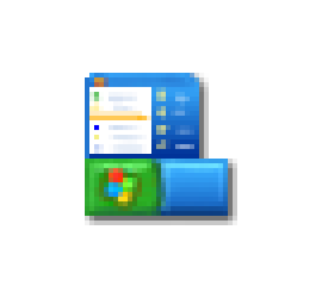

> 
>
><strong>Latest update <code>[September 13, 2023]</code>:</strong>
>
>MSAL.NET 4.56.0 is released. Make sure to <a href="https://www.nuget.org/packages/Microsoft.Identity.Client/">update your packages</a>!

	
	<h1>Hi, I am Den 👋</h2>
	

		<b>Learn more about the things I do</b>
	

You just found my work account that is used exclusively for work-related projects. I am currently employed at **Microsoft** as a **Principal Product Manager** in the Identity SDK team. This is the team, that among other things, builds the **[Microsoft Authentication Library (MSAL)](https://learn.microsoft.com/entra/msal/)**.

	
	<h2>Professional Work</h2>
	

		<b>Things I build at Microsoft</b>
	

This is as much as I can share publicly about what I do. If you work at Microsoft and want to partner on any of the items above, **[send me a note](#contact)**.

| | Details |
|:---|:---|
|  | I am the product manager (PM) for **[Microsoft Authentication Library (MSAL) .NET](https://learn.microsoft.com/entra/msal/dotnet/)** and **[Microsoft Authentication Library (MSAL) for Go](https://learn.microsoft.com/entra/msal/go/)**. |
|  | I write for the **[Microsoft Entra Identity Developer Blog](https://devblogs.microsoft.com/identity/)**. |
|  | I am engaging with the community building applications using MSAL **[on Stack Overflow](https://stackoverflow.com/questions/tagged/azure-ad-msal)**, and wherever the community is. |
|  | I help write code samples and **[documentation](https://learn.microsoft.com/entra/msal/)** that helps developers get started with the MSAL family of libraries. One of the projects I help with right now is moving all the Wiki content from GitHub to Microsoft Learn. |
|  | I dig through data to help folks using MSAL optimize their usage. |
|  | I am **[helping our customers migrate](https://learn.microsoft.com/azure/active-directory/develop/msal-migration)** from our old library (Azure Active Directory Authentication Library, or ADAL for short) to the modern MSAL stack. |
|  | I engage closely with our internal and external customers and partners to design maintainable APIs for our portfolio of SDKs. |

	
	<h2>Contact</h2>
	

		<b>Get in touch</b>
	

If you have any feedback on our authentication libraries, send me a note: `den@microsoft.com`. Complaints and roadmap suggestions are fair game, as long as you include your scenarios!

> **Warning**
>
> Keep in mind that this address is only for feedback around MSAL or if you want to inquire about things that are not technical support. For questions on how to use MSAL, feel free to use the appropriate GitHub issues or <strong><a href="https://stackoverflow.com/questions/tagged/azure-ad-msal">Stack Overflow</a></strong>.

	
	<h2>Personal Work</h2>
	

		<b>What I do outside of Microsoft</b>
	

You might want to check out [my personal account](https://github.com/dend) to learn about public (external-facing) projects I work on. Not that you can't follow this one too - there is some great Microsoft-related stuff here.

While at it, stop by [my blog](https://den.dev).

	
	<h2>Notable Resources</h2>
	

		<b>Things to check out</b>
	

* **[Using the Microsoft Authentication Library with the Windows authentication broker](https://devblogs.microsoft.com/identity/msal-net-wam/)**
* **[Announcing Microsoft Authentication Library for .NET 4.54.0, with General Availability of Managed Identity APIs](https://devblogs.microsoft.com/identity/msal-net-managed-identity-ga/)**
* **[Update your applications from ADAL to MSAL](https://devblogs.microsoft.com/identity/update-your-applications-from-adal-to-msal/)**
